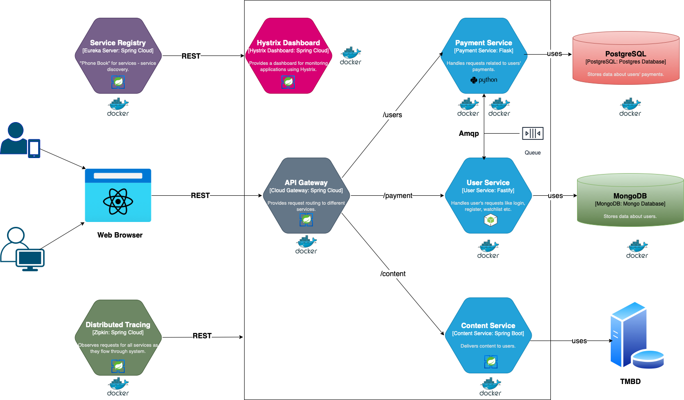

# Netflix-Clone

This is a project that I created for my Bachelor's Thesis. It is related to the topics we learned during Distributed Systems course, but I also included a lot of things that I learned on my own.

# Application architecture

# Features

It includes:
* Login & Registration (JWT Authorization, Password hashing included)
* Email verification
* User profile(s) with Payment settings
* Account deactivation
* New Arrivals, Netflix Originals and several other categories for movies and TV shows
* Watchlist for every user
* Like/dislike option
* Video (trailer) streaming

# Project structure

Frontend is built with Next.js

Backend consists of several services:
* User Service (Fastify)
* Payment Service (Flask)
* Content Service (Java with external TMDB api)
* Service Registry, Cloud Gateway, Hystrix Dashboard (Spring Cloud)
* Zipkin

Backend runs on Docker-compose setup, with 2 additional databases - MongoDb (User Service) and PostgresSql (Payment Service)
It also uses Rabbitmq for internal communication between User and Payment services.

# How to run it

1. Clone this repo
2. cd into Backend folder
3. Run docker-compose up
4. cd into Frontend/netflix folder
5. Run npm install && npm start

# Future improvements
- I could include some ML to recommend movies and TV shows based on user's list and liked videos.
- Separate Kids and Adult content.
